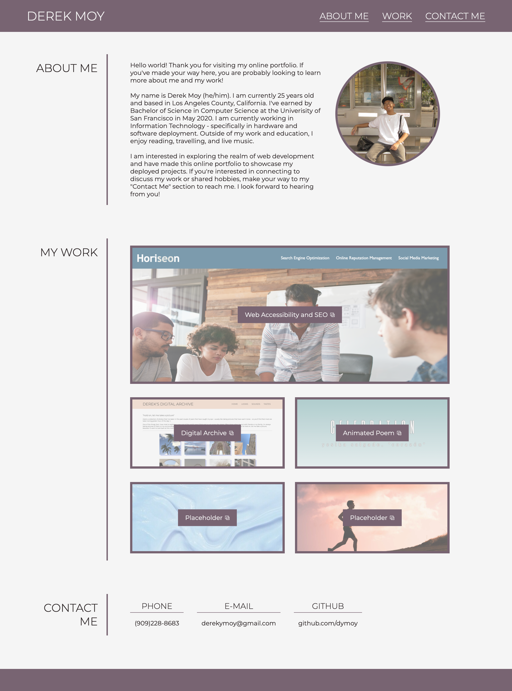
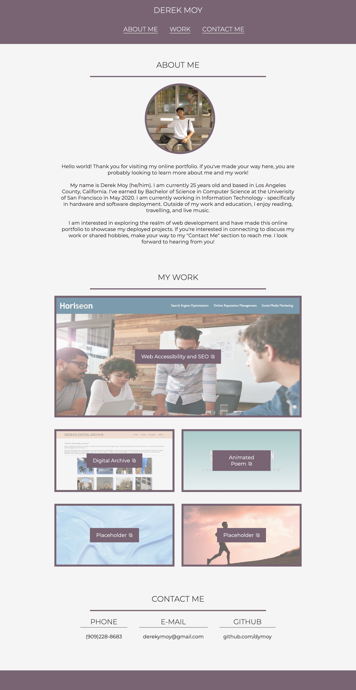

## Name 

Online Portfolio 

## Description

The goal of this project is to create an online portfolio to showcase my skills and web developement projects to potential employers. 

My webpage is split into 3 major sections: About Me, My Work, and Contact Me. This gives visitors a small summary of myself, some highlighted projects, and points of contact to reach me.  

## Installation 

N/A

## Usage 
Use the following link to access the deployed webpage: 
https://dymoy.github.io/online-portfolio/

The source code is found in the root directory of the main branch. 

## Visuals 

### Screenshot of webpage fullsize: 

### Screenshot of webpage when resized smaller: 

## License 

Please refer to the license in the repo.
